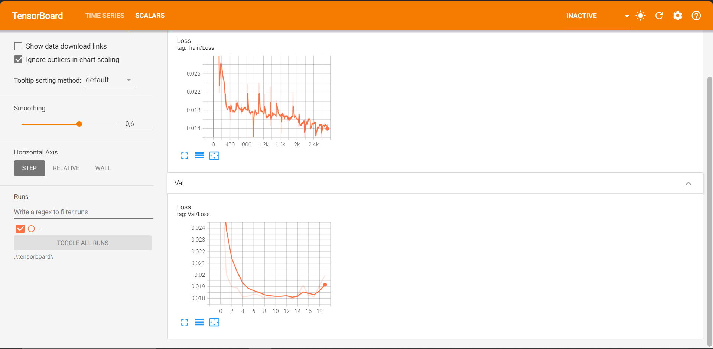

# [PYTORCH] Self-Driving-Car (simulator version) [Still Updating...]

## Introduction

This project demonstrate basic self driving car model using udacity car driving simulator. In this project we will be building a Convolution Neural Network model to predict the **steering angle** for a virtual car in the simulator running at a constant speed. The goal is to drive the car in the simulator autonomously for a full lap without deviating from the main track/road. 

1. As a first step, we will show the model(training) how to drive in the track by manually driving the car (simulator in training mode) without making any mistake.
2. During this training drive, we will record the vehicle sensor values (virtual camera images of the car, steering angle sensor value, speed sensor value) in to a folder.
3. Then we will feed this data to a CNN model described in the paper **End to End Learning for Self-Driving Cars** [paper](https://images.nvidia.com/content/tegra/automotive/images/2016/solutions/pdf/end-to-end-dl-using-px.pdf) with some small adjustment for better prediction. During this training time the model will learn the steering angle or the maneuvers that you applied for different road situations like left curve, straight road, right curve , approaching the side lane and departing from the side lane. 
4. After training the model, we will run the model with real time virtual camera sensor data from the simulator as input , and use the output of the model to control the steering angle of the car in the simulator, in effect the model will be controling the steering of the car in the simulator.

Udacity self driving car simulator is used testing and training our model.

 
## How to use my code

With my code, you can:
* **Train your model from scratch**
* **Train your model with my trained model**
* **Evaluate with either my trained model or yours**

## Datasets:

1. You can download the simulator [here](https://github.com/udacity/self-driving-car-sim/tree/v1.45).
2. First run the pre-build simulator executable from the extracted folder.
3. Once it is launched, choose training option from the main window.
4. Now click on the record button and choose 'dataset/' folder for saving driving data.
5. Align the car on the track and then click on the record button again, then drive the car in the track for 9 or 10 laps. Click on the record button again to stop recording.
6. After recording, the recorded images and driving_log.csv files can be found under respective folders.
7. We only get image from the center camera for training, run the script:

        python format_data.py -d dataset/ -i augmented_images/ 

## Setting:

I made a small change compared to the original paper: the input planes will have a size of 160x320 instead of 60x200 as in the paper. This small adjustment improved the model's accuracy. For optimizer and learning rate, I use:

* Adam optimizer with different learning rates (0.001 in most case).
* The loss function will be mean squared error since the output is a continuous variable aimed at predicting the steering angle of the wheel.

## Trained models

You could find trained model I have trained in [link](https://drive.google.com/drive/folders/1AfqrugVAcFHUq4GnXcwU8K0W5qufQEUi?usp=sharing)

Currently, my model can only complete half of the lap and is not yet able to finish 100%.
## Training

I provide my pre-trained model named best.pt in checkpoint folder. You can place it in the folder checkpoint/ and load it before training your new model for faster convergence.

      python train.py -d dataset/augmented_driving_log.csv -z checkpoint/best.pt

If you want to train a new model, you could run:

      python train.py -d dataset/augmented_driving_log.csv

## Test

By default, my test script will load trained model from folder checkpoint/. You of course could change it to other folder which contains your trained model(s).

1. Lauch the simulator 

2. Once it is launched, choose Autonomous mode from the main window (Now the simulator should be ready to accept a connection).

3. Then run 'drive.py' with the following command.

        python drive.py 'path to the created model.pt file'

## Experiments:

The training/test loss curves for each experiment are shown below:

- **Loss**

## Results

The following GIF shows the output of 'best.pt' model.   

Currently, my model can only complete half of the lap and is not yet able to finish 100%.

